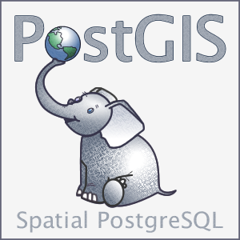
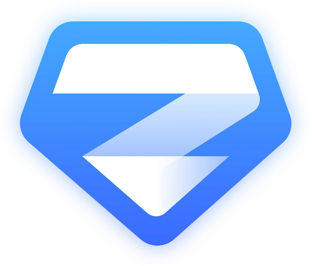
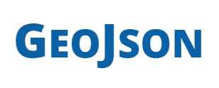
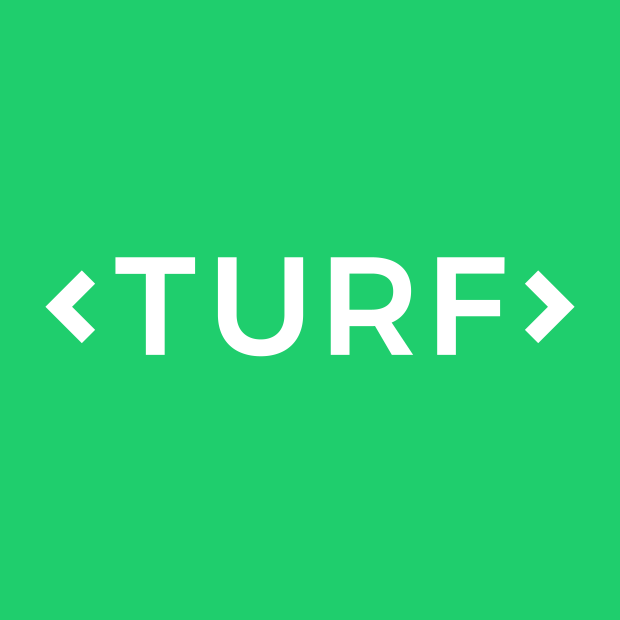

# Progetto Programmazione Avanzata - Gestione di imbarcazioni da pesca
## 🗃️ Indice

| Sezione | Descrizione |
|--------|-----------|
| [Obiettivo del progetto](#obiettivo-del-progetto) | Obiettivo principale del progetto e breve spiegazione delle funzionalità. |
| [Tecnologie usate per lo sviluppo](#-tecnologie-usate-per-lo-sviluppo)| Lista di tecnologie e framework utilizzati per il developement.
| [Entità coinvolte](#-entità-coinvolte)| Lista di tecnologie e framework utilizzati per il developement.
| [Diagramma dei casi d'Uso](#diagramma-dei-casi-duso) | Spiegazione. |
| [Rotte e diagrammi di sequenza](#rotte-e-diagrammi-di-sequenza) | Panoramica delle rotte più importanti con diagrammi di sequenza. |
| [Design Pattern implementati](#) | Pattern architetturali scelti durante lo sviluppo e le motivazioni. |
| [Installazione ed avvio dell'applicazione](#) | Esecuzione dell'applicazione con Docker. |
| [Testing](#testing) | Testing tramite Postman e Jest. |
| [Autori](#autori) | Autori del progetto. |

## 🎯Obiettivo del progetto
L'obiettivo del progetto consiste nell'implementare un backend per la gestione di utenti, imbarcazioni e delle geofence aree, cioè dei perimetri virtuali associati ad aree geografiche del mondo reale.

## 🏗️Tecnologie usate per lo sviluppo
Per lo sviluppo del progetto sono state utilizzate diverse tecnologie e librerie, ognuna con uno scopo ben preciso:

-  `TypeScript`: linguaggio principale utilizzato per lo sviluppo del backend. Grazie alla tipizzazione statica consente di ridurre gli errori durante lo sviluppo e rende il codice più leggibile e manutenibile.
-  `Bun`: runtime JavaScript utilizzato per l'esecuzione dell'applicazione e la compilazione del codice TypeScript. Offre prestazioni elevate e tempi di avvio sensibilmente inferiori rispetto ad altri runtime tradizionali.
-  `Nodemon`: strumento utilizzato durante la fase di sviluppo che riavvia automaticamente l'applicazione ogni volta che vengono rilevate modifiche ai file del progetto, velocizzando il ciclo di sviluppo.
-   `PostgreSQL` +  `PostGIS`: PostgreSQL è il database relazionale utilizzato per la persistenza dei dati, mentre l'estensione PostGIS aggiunge il supporto ai dati geografici e alle operazioni spaziali, indispensabili per la gestione delle geofence aree e delle coordinate delle imbarcazioni.
-  `JWT` (JSON Web Token): sistema di autenticazione adottato dal backend. Dopo il login viene generato un token firmato che identifica l'utente autenticato e consente di accedere alle rotte protette senza dover reinserire le credenziali ad ogni richiesta. L'algoritmo usato per la firma è RS256.
### Librerie principali
-  `Zod`: libreria utilizzata per la validazione dei dati ricevuti dalle richieste HTTP, garantendo che i parametri rispettino il formato previsto prima di essere elaborati dal server.
-  `Sequelize`: ORM impiegato per interagire con il database PostgreSQL tramite modelli TypeScript, semplificando la gestione delle query e delle relazioni tra le entità.
-  `GeoJSON`: libreria utilizzata per rappresentare e manipolare dati geografici secondo lo standard GeoJSON, impiegato per la definizione delle geofence aree.
-  `Turf.js`: libreria geospaziale utilizzata per eseguire calcoli geometrici, come la verifica della presenza di auto intersezioni in un poligono.
-  `Jest`: framework utilizzato per il testing automatico dell'applicazione. Consente di realizzare unit test e test di integrazione, verificando il corretto funzionamento delle funzionalità implementate e contribuendo a garantire l'affidabilità del backend durante lo sviluppo e le successive modifiche al codice.

## 👥Entità coinvolte

### 👤Utenti
Gli utenti sono composti dai seguenti campi:
- `user_id`: codice identificativo univoco assegnato al momento della registrazione.
- `username`: nome utente univoco.
- `email`: indirizzo email.
- `password`: password per accedere al proprio account.
- `tokens`: saldo dei token, utilizzati per effettuare le richieste.
- `created_at`: timestamp della registrazione dell'utente.
  
Gli utenti possono registrarsi fornendo un `username`, un'`email` ed una `password`. Dopo la registrazione, l'utente può loggarsi con le proprie credenziali ed effettuare richieste. Esistono due tipi di utente:
- utente `admin`, il quale può effettuare varie operazioni tra cui la creazione di imbarcazioni, di geofence aree, ricarica dei token degli utenti ed altro.
- utente `normale`, il quale può vedere il saldo dei propri token, invio dei dati di posizione delle proprie imbarcazioni, il quale richiede l'uso di `0.025` token per invio, vedere a quali geofence aree sono autorizzate ad accedere le proprie imbarcazioni, vedere se le proprie imbarcazioni si trovano o no dentro una specifica geoarea (in caso positivo anche il relativo tempo di permanenza) ed infine vedere quali, tra le proprie imbarcazioni, hanno delle segnalazioni.

### 🗺️Geofence aree
Le geofence aree sono composte dai seguenti campi:
- `geoarea_id`: codice identificatore univoco assegnato al momento della creazione. 
- `name`: un nome univoco
- `area`: un'area definita da un insieme di punti, i quali formano un poligono chiuso che non può auto intersecarsi.
- `max_speed`: un limite di velocità massimo consentito in quella geofence area (opzionale).
- `ultima_violazione_valida_id`: il codice identificativo dell'ultima violazione valida registrata in essa.
- `created_at`: timestamp della creazione della geofence area.

### 🛥️Imbarcazioni
Le imbarcazioni sono composte dai seguenti campi:
- `mmsi`: codice identificativo univoco dell'imbarcazione (*Maritime Mobile Service Identity*).
- `name`: nome univoco dell'imbarcazione.
- `type`: tipologia dell'imbarcazione. In questo progetto si gestiscono solo imbarcazioni da pesca.
- `descr`: descrizione dell'imbarcazione.
- `max_capacity`: capacità massima di persone dell'imbarcazione.
- `user_id`: identificativo dell'utente proprietario dell'imbarcazione.
- `created_at`: timestamp della registrazione dell'imbarcazione.

Ogni imbarcazione è associata ad un solo utente proprietario, mentre un utente può possedere più imbarcazioni. Le imbarcazioni possono essere autorizzate ad accedere a specifiche geofence aree, inviare periodicamente i propri dati di posizione ed essere coinvolte in violazioni e segnalazioni.

### 🔗Geofence-Imbarcazioni
L'associazione tra geofence aree ed imbarcazioni è realizzata mediante una tabella di relazione composta dai seguenti campi:
- `geoarea_id`: identificativo della geofence area.
- `mmsi`: identificativo dell'imbarcazione.

Questa relazione permette di definire quali imbarcazioni sono autorizzate ad accedere ad una determinata geofence area. Una geofence area può autorizzare più imbarcazioni, così come una stessa imbarcazione può essere autorizzata ad accedere a più geofence aree.

### 📡Dati inviati
I dati inviati rappresentano le informazioni di posizione trasmesse periodicamente dalle imbarcazioni e sono composti dai seguenti campi:
- `id`: codice identificativo univoco del dato inviato.
- `mmsi`: identificativo dell'imbarcazione che ha effettuato l'invio.
- `latitudine`: latitudine della posizione inviata.
- `longitudine`: longitudine della posizione inviata.
- `velocita_kmh`: velocità dell'imbarcazione espressa in km/h.
- `created_at`: istante dell'invio espresso in formato Unix Epoch.
- `stato`: stato operativo dell'imbarcazione.

Lo stato può assumere uno dei seguenti valori:
- `IN NAVIGAZIONE`
- `IN PESCA`
- `STAZIONARIA`

Ogni invio viene utilizzato dal sistema per verificare l'eventuale ingresso nelle geofence aree, il rispetto dei limiti di velocità e la presenza di eventuali violazioni.

### ⚠️Violazioni
Le violazioni registrano gli eventi nei quali un'imbarcazione non rispetta i vincoli imposti dal sistema e sono composte dai seguenti campi:
- `id`: codice identificativo univoco della violazione.
- `tipo`: tipologia della violazione.
- `mmsi`: identificativo dell'imbarcazione coinvolta.
- `geoarea_id`: identificativo della geofence area interessata.
- `conta_in_segnalazione`: indica se la violazione deve essere considerata per la generazione di una segnalazione. Un'imbarcazione può generare due violazioni nello stesso momento ed in questo caso se ne conta solo una.
- `created_at`: timestamp della registrazione della violazione.

Le violazioni possono essere di due tipi:
- `ECCESSO VELOCITÀ`, quando viene superato il limite di velocità previsto dalla geofence area.
- `ACCESSO AREA NON AUTORIZZATA`, quando un'imbarcazione entra in una geofence area senza essere autorizzata.

### 🚨Segnalazioni
Le segnalazioni rappresentano gli eventi generati dal sistema a seguito del verificarsi di violazioni ripetute all'interno di una geofence area e sono composte dai seguenti campi:
- `id`: codice identificativo univoco della segnalazione.
- `geoarea_id`: identificativo della geofence area interessata.
- `stato`: stato corrente della segnalazione.
- `created_at`: timestamp della creazione della segnalazione.

Una segnalazione può assumere uno dei seguenti stati:
- `IN CORSO`
- `RIENTRATA`

Ogni segnalazione può coinvolgere una o più imbarcazioni responsabili delle violazioni che ne hanno determinato la generazione. La generazione avviene se in un arco temporale di 2 giorni dall'ultima violazione valida, ci sono 6 o più violazioni. Invece, se dall'ultima violazione valida vi sono 5 o meno violazioni, l'ultima segnalazione per quella geofeance area va in stato RIENTRATA. Se dall'ultima violazione valida viene registrata un'altra violazione che dista almeno 1 ora, allora questa sostituirà l'ultima violazione valida, spostando la finestra temporale.

### 🔗Imbarcazioni-Segnalazioni
L'associazione tra segnalazioni ed imbarcazioni è realizzata mediante una tabella composta dai seguenti campi:
- `id_segnalazione`: identificativo della segnalazione.
- `mmsi`: identificativo dell'imbarcazione coinvolta.

Questa relazione consente di associare ad una segnalazione tutte le imbarcazioni che hanno contribuito alla sua generazione.

### 📖Log spostamenti
Il logging degli spostamenti è fondamentale per memorizzare tutti gli ingressi e le uscite delle imbarcazioni dalle geofence aree autorizzate. Esso è rappresentato da una tabella composta dai seguenti campi:
- `id`: codice identificativo univoco del movimento registrato.
- `mmsi`: identificativo dell'imbarcazione.
- `geoarea_id`: identificativo della geofence area.
- `spostamento`: tipologia dello spostamento registrato.
- `created_at`: timestamp dell'evento.

Il campo `spostamento` può assumere i seguenti valori:
- `ENTRATA`
- `USCITA`

Il log degli spostamenti viene utilizzato per ricostruire la permanenza delle imbarcazioni all'interno delle geofence aree e per determinare il tempo trascorso al loro interno.